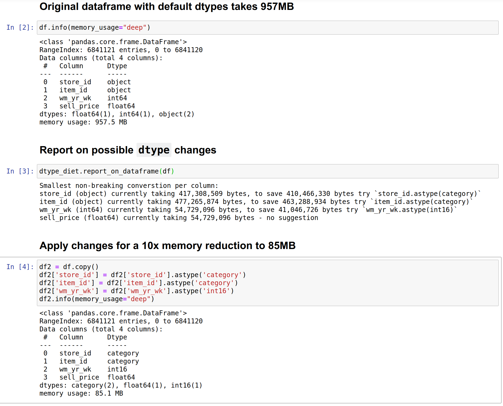

# Attempt to shrink Pandas `dtypes` without losing data so you have more RAM (and maybe more speed)

Status - early alpha, written in 2 hours on a Sunday. Suggestions welcome, I may accept PRs but you're better off asking first (via a bug report) with the suggestion in case it isn't where I want to take the library. I'm also very happy to have "Thanks" posted via bugs too if this helps you out :-)

This tool checks each column to see if larger dtypes (e.g. 8 byte `float64` and `int64`) could be shrunk to smaller `dtypes` without causing any data loss. 
Dropping an 8 byte type to a 4 (or 2 or 1 byte) type will keep halving the RAM requirement for that column.  Categoricals are proposed for `object` columns which can bring significant speed and RAM benefits.

Whilst working on the [2nd edition of High Performance Python](https://www.goodreads.com/book/show/49828191-high-performance-python) with Micha Gorelick I wrote on RAM reduction in the Using Less RAM chapter for Pandas and NumPy and I wanted to write a tool like this, but didn't have time (heck, writing the 2nd edition took 9 months!). So, I got to write this tool after publication instead.

Here's an example (see Notebook: ./example_sell_prices_ram_shrinkage.ipynb) on a Kaggle dataset showing a reduction of 957 -> 85MB:



Recommendations:

* Run `report_on_dataframe(your_df)` to get recommendations
* Consider if Categoricals will save you RAM (see Caveats below)
* Consider if f32 or f16 will be useful (see Caveats - f32 is _probably_ a reasonable choice unless you have huge ranges of floats)
* Consider if int32, int16, int8 will be useful (see Caveats - overflow may be an issue)
* Look at https://pandas.pydata.org/pandas-docs/stable/reference/api/pandas.DataFrame.convert_dtypes.html which recommends Pandas nullable dtype alternatives (e.g. to avoid promoting an int64 with NaN items to float64, instead you get Int64 with NaNs and no data loss)

Look at `__main__` and try `report_on_dataframe(your_df)` to get a printed report - no changes are made to your dataframe.

```
# example run on a made-up dataframe in __main__

dtype_diet$ python dtype_diet.py 
Given a dataframe, check for lowest possible conversions:
Smallest non-breaking converstion per column:
a (int64) currently taking 928 bytes, to save 700 bytes try `a.astype(int8)`
b (int64) currently taking 928 bytes, to save 600 bytes try `b.astype(int16)`
c (int64) currently taking 928 bytes, to save 400 bytes try `c.astype(int32)`
d (float64) currently taking 928 bytes, to save 600 bytes try `d.astype(float16)`
e (float64) currently taking 928 bytes, to save 400 bytes try `e.astype(float32)`
str_a (object) currently taking 6,328 bytes, to save 5,958 bytes try `str_a.astype(category)`
str_b (object) currently taking 6,018 bytes - no suggestion
```

## Caveats

* reduced numeric ranges might lead to overflow (TODO document)
* category dtype can have unexpected effects e.g. need for observed=True in groupby (TODO document)
* f16 is likely to be simulated on modern hardware so calculations will be 2-3* slower than on f32 or f16
* we could do with a link that explains binary representation of float & int for those wanting to learn more

## Development 

There's a bunch of interesting notes in the initial Tweet I sent out: https://twitter.com/ianozsvald/status/1267129298646941696 (thanks to all who replied).

### Releases

Run `pytest dtype_diet.py` (better yet - add more tests!). Push to github.

### Setup

```
$ conda create -n dtype_diet python=3.8 pandas jupyter pyarrow pytest
$ conda activate dtype_diet
```
